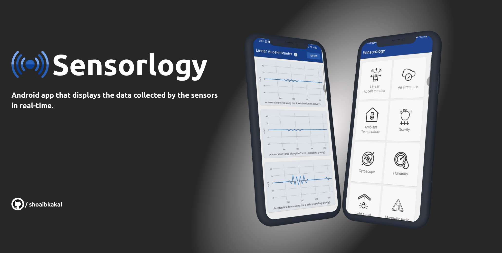
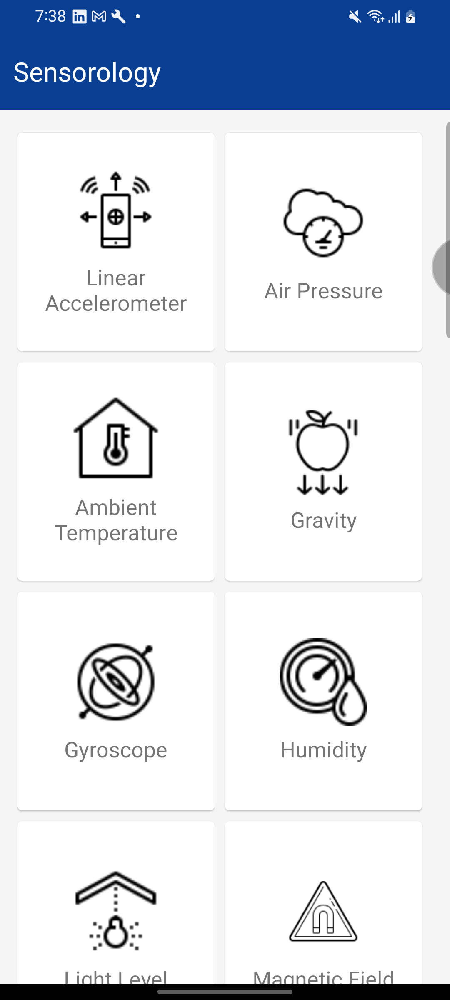
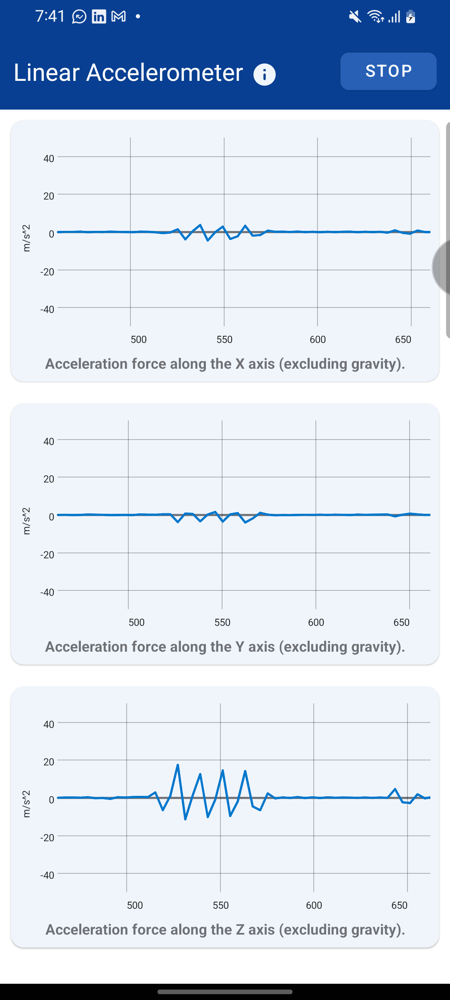
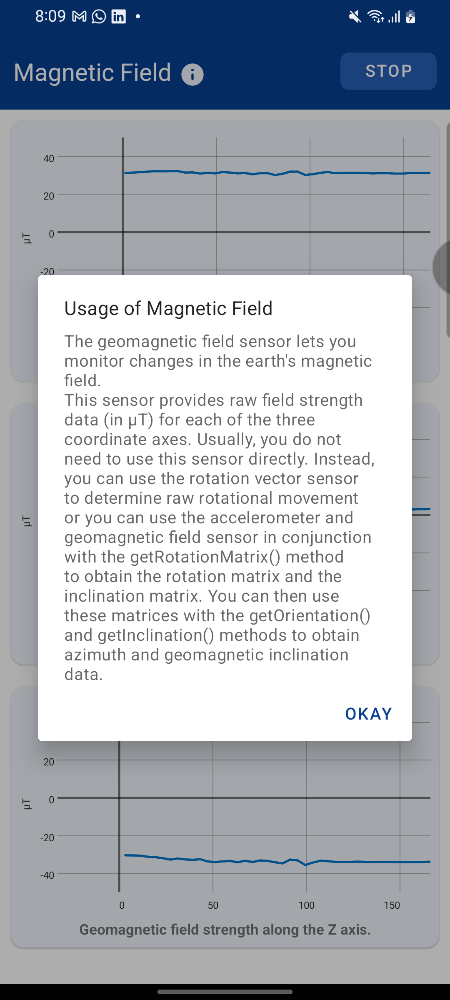
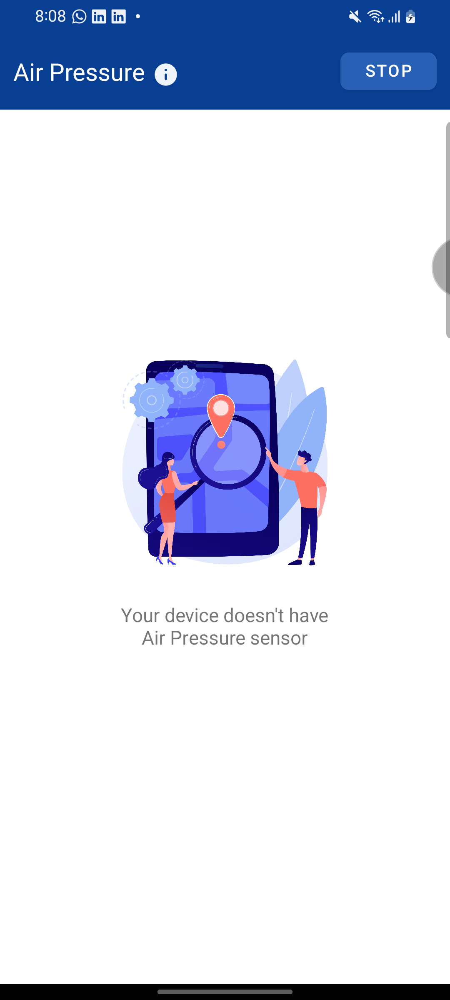

# Sensorology
Sensorology allows users to view and interact with the various sensors on their device, utilizing GraphView to display the sensor data in real-time.

  ### Sensors Implemented 
  1. Linear Accelerometer
  2. Air Pressure
  3. Ambient Temperature
  4. Gravity
  5. Gyroscope
  6. Humidity
  7. Light Level
  8. Magnetic Field
  9. Device Temperature
  10. Orientation
  11. Proximity
  12. Rotation Vector
  13. Step Detector
  
### Contributors

Thanks goes to these wonderful people:
<!-- ALL-CONTRIBUTORS-LIST:START - Do not remove or modify this section -->
<!-- prettier-ignore -->

<table>
  <tr>
      
  <td align="center"><a href="https://github.com/shoaibkakal"> <b>Shoaib Kakal</b></a> </td>
  
  </tr>
</table>
